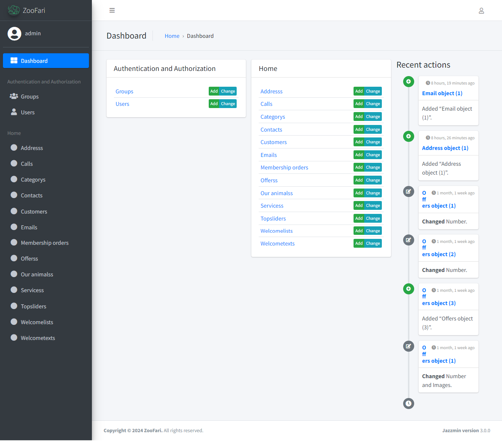
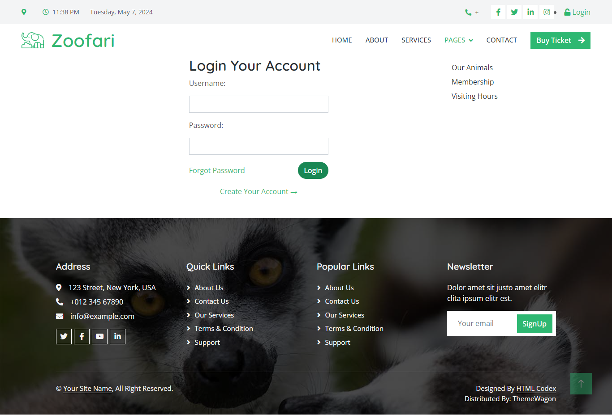
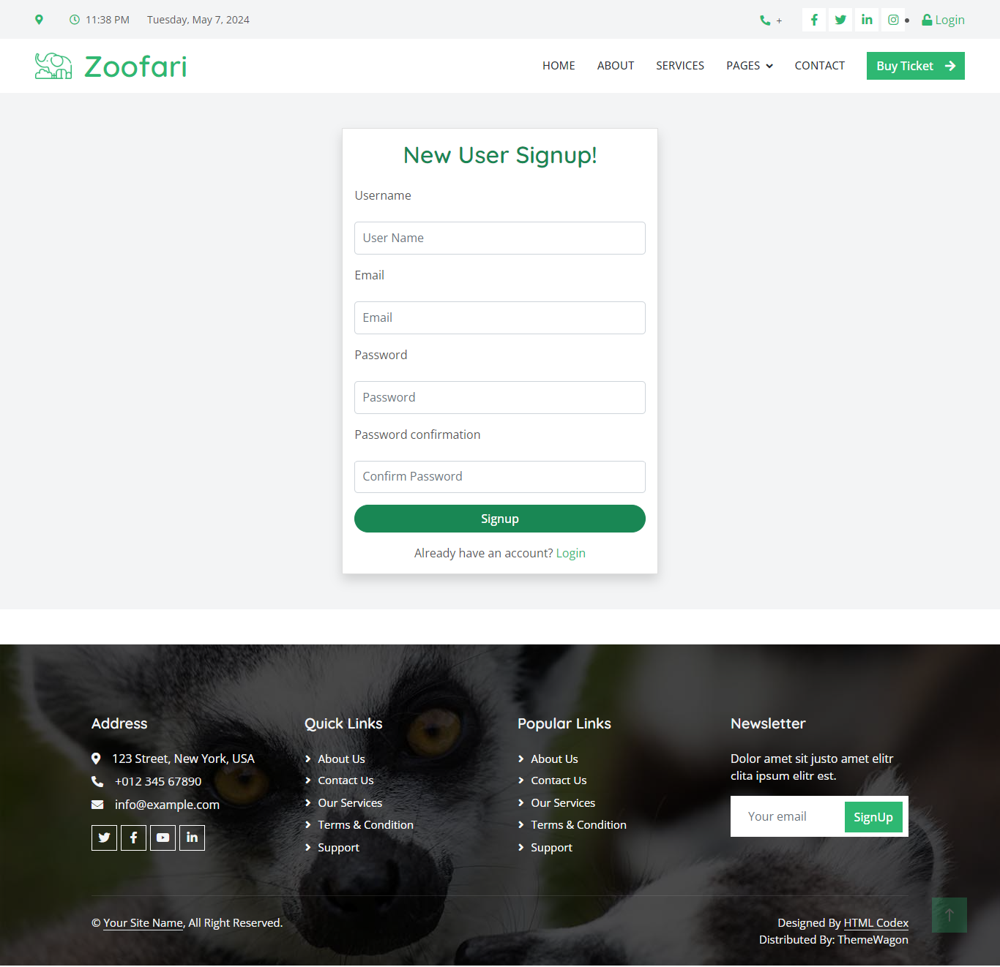
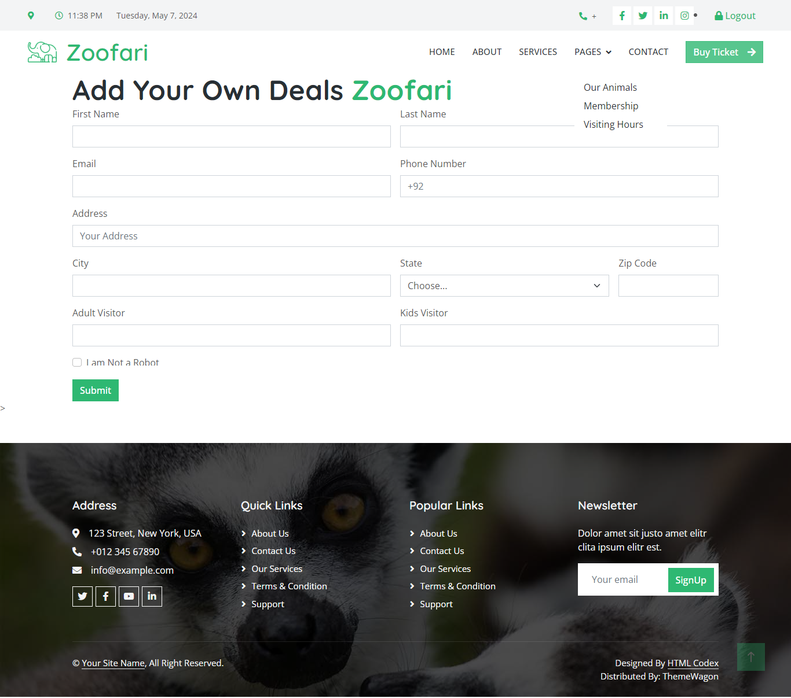

# ZooFari Dajngo Project

This project is designed for the Zoo Visiting Application.

## How to Use

1. Clone the repository to your local machine.
2. Add virtual Environments.
3. Install all requirements.
4. This is a Web application.

## Project Images

